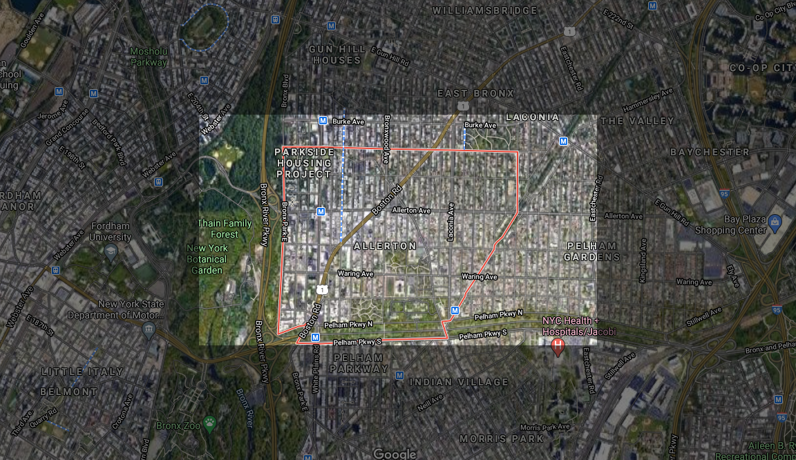
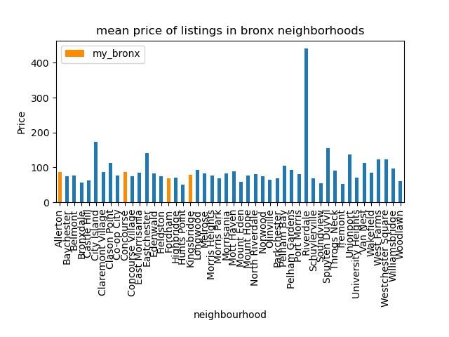
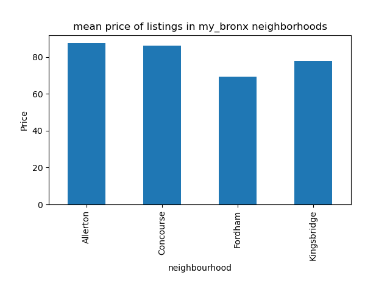
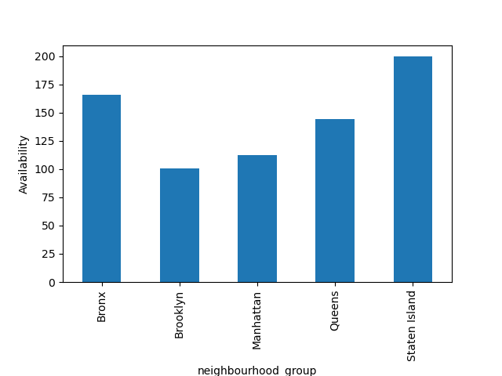

## Allerton, the Bronx

Demographics:
- Median age: 40.
- Population: ~74000.
- By age: 21% 18 or under, 23% 18 to 35, 39% 35 to 65, 16% over 65.
- 51% black, 29% Hispanic, 10% white, 6% other ethnicities
- ~85% have at least a GED, 25% of whom have a bachelor’s degree.
- 40% of population are foreign born, 70% of which are from Latin America.
- 91% employment rate with a median household income of $63,000, however ~15% of the population are below the poverty line.

Allerton receives an average rating from our rankings. Though it has many local points of interest for airbnb customers to experience and sufficient methods of public transportation to go to these points, the neighborhood is not very safe and has a history of higher levels of crime compared to the rest of the country.

##### HC7/8 observations

The price values for airbnb locations in Allerton are similar to those of all 4 neighborhoods assigned to my group and most of the Bronx neighborhoods, however it appears that Allerton has one outlier in the form of the 450 datapoint that skews its mean and standard deviation slightly higher. Allerton’s airbnb prices are around 70 to 100 dollars per day, which is similar to that of Bronx and lower than that of all of NYC (100 to 175). Considering our neighborhoods had a relatively poor safety rating (at around a C or so), it would make sense that the prices are lower. The owners in the Bronx and in Allerton are aware that customers are not as willing to rent an airbnb in less secure neighborhoods and will have to lower prices to make their offers seem more appealing.

See attached plots for a more detailed display of the comparison between costs in Allerton and the other neighborhoods, as well as between the Bronx and the other boroughs.

Here, we see that the mean prices between the four neighborhoods we chose (highlighted in orange) are below a small majority of the neighborhoods in the Bronx. This conforms to our observations in HC7/8.

Compared to each other, the four neighborhoods are similar in their average prices. While Fordham is visibly lower in price, it is only an approximately $10 difference.

##### airbnb locations in Allerton

<dl>
<iframe src="allertonLocations.html" width="600" height="400" frameborder="0" frameborder="0" marginwidth="0" marginheight="0" allowfullscreen></iframe>
</dl>

###### Click [here](https://jessicalrsparacio.github.io/TheBronx/) to return to the main page.
